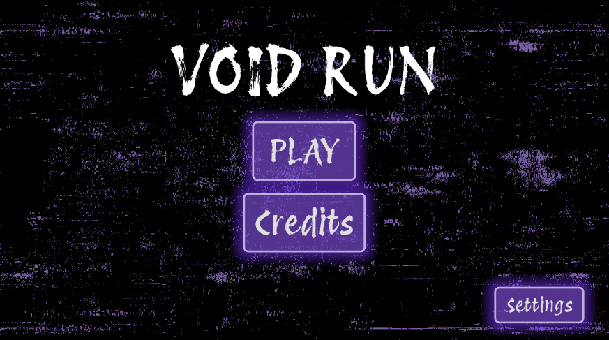

# Void Run

### Run forever through the void
Void run is an endless runner game where you dodge obstacles as you try to get as far as you can.

This game has been designed for mobile but also runs on windows

## Get on Itch!
[Itch Page!](https://faceinthespace.itch.io/void-run)

## Known Bugs:
- Background is jittery on some devices
- Hitboxes of some objects need to be adjusted slightly

## New Version 2 features

1. coin spawning
2. coin collection
3. upgrade shop
4. life upgrade
5. powerup purchase 
6. shield powerup
7. price scaling
8. shield upgrades 
9. screen size improvement
10. Better slide mechanics

## Credits:
- Game made by Keyra Webb
- Brushes used to help make assets - [Devin Elle Kurtz](https://tamberella.gumroad.com)
- Player character asset - [RedMars](https://kangkan.itch.io/helmet-girl)
- Protest Revolution Font - Google Fonts
